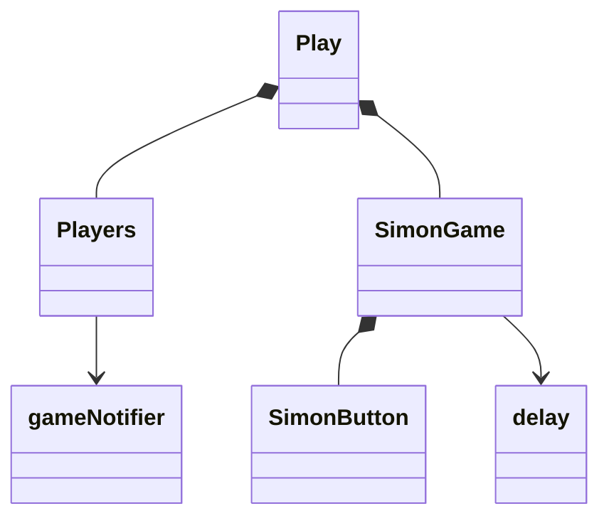

# Simon React


This deliverable demonstrates using JavaScript for user interaction, [React](https://reactjs.org/) as a web framework, and Vite as your frontend tooling. This helps with tasks such as building modular components, providing reactive UI elements, supporting sessions, lazy loading, and reducing (minifying) the size of your application.

As part of the move to React, we convert Simon from a **multi-page application** (MPA) to a **single-page application** (SPA). In a single-page application, the browser only loads a single HTML file (index.html), and then we use JavaScript to interactively change the rendered content and components. This is a significant architectural shift to the application and will require you to reorganize your code to fit the single-page, component driven, model.

# Steps to convert Simon to React

The following section discusses the general steps taken to convert the Simon application from a simple HTML/CSS application to a React application. You will need to take similar steps for your startup project, and so it is important to understand what is happening at each step of the conversion process. You don't necessarily have to go through this process with the Simon demonstration application, but it is a safe place to try since you have both the starting version (simon-css) and the ending version (simon-react) to reference.

We begin by introducing `vite`, our frontend tooling. The HTML and CSS is then reworked into React components. The React components are then reworked to take advantage of functionality that React provides. This includes function style components, modularization, reactive interactions, and a React representation of Bootstrap.

Here is a complete list of all the steps involved to convert Simon to a React application. When you port your startup to React you will want to commit your changes as you complete each step in the process.

1. Install and configure Vite
1. Replace deployment script
1. Reorganize the code
1. Convert to React Bootstrap
1. Enable React
1. Create app component
1. Create view components
1. Create the router
1. Convert scores component
1. Convert other components

Once we have completed the port we will talk about how to add JavaScript to the application.

## Install and configure Vite

While in the project root directory, setup NPM and install Vite as a development dependency by running:

```sh
npm init -y
npm install vite@latest -D
```

Then insert/replace the `scripts` found in the newly created `package.json` file located in your project root directory to include the commands for running Vite. You can also clean up the description field and remove other unused fields.

```json
  "scripts": {
    "dev": "vite",
    "build": "vite build",
    "preview": "vite preview"
  }
```

⚠ Make sure you add `node_modules` to your `.gitignore` file so that you don't commit the imported NPM code.

This script is similar to the previous script, but it includes a step

## Reorganize the code

We start with the simon-css code that currently looks like this:

```sh
├─ LICENSE
├─ README.md
├─ about.css
├─ about.html
├─ deployFiles.sh
├─ favicon.ico
├─ index.html
├─ main.css
├─ placeholder.jpg
├─ play.css
├─ play.html
└─ scores.html
```

Create a `public` directory that is going to hold all the application image and sound assets. After we create the folder we move the `placeholder.jpg` and `favicon.jpg` files into it. We then add new files that represent the sounds we want to use as we play the game.

Next we create a `src` directory where we will put all of the React code. Under the `src` directory we create a folder for each of the view component that represent the major functionality of the Simon application.

Finally rename `main.css` to `app.css` and move it to the `src` directory. This will contain all the styles that are shared across the application. You will need to tweak the `body` rule set to use the `.body` selector since our SPA works on components within the body element. This change should look like the following.

```css
.body {
  display: flex;
  flex-direction: column;
  min-width: 375px;
}
```

When we are done it will look like this.

```sh
├─ public                      # Static assets used in the app
│   ├─ button-bottom-left.mp3
│   ├─ button-bottom-right.mp3
│   ├─ button-top-left.mp3
│   ├─ button-top-right.mp3
│   ├─ error.mp3
│   ├─ favicon.ico
│   └─ placeholder.jpg
└─ src                         # Frontend React code
    ├─ app.css                 # Top level styles
    ├─ about                   # About component
    ├─ login                   # Login component
    ├─ play                    # Game play component
    └─ scores                  # Scores component

```

## Convert to React Bootstrap

There is an NPM package called [React Bootstrap](https://react-bootstrap.github.io/) that wraps the Bootstrap CSS framework in React components. This allows you to treat the Bootstrap widgets, such as Button and Modal, as a React component instead of just imported CSS and JavaScript.

To use the React version of Bootstrap, import the NPM package.

```sh
npm install bootstrap react-bootstrap
```

Now, in the components where you want to refer to the Bootstrap styles, you can import the Bootstrap style sheet from the
imported NPM package just like you would other CSS files.

```jsx
import 'bootstrap/dist/css/bootstrap.min.css';
```

To use a React Bootstrap component, you would import and reference the specific component you want to use. Here is an example of using the `Button` component.

```jsx
import Button from 'react-bootstrap/Button';

export function NavButton({ text, url }) {
  const navigate = useNavigate();
  return (
    <Button variant='primary' onClick={() => navigate({ url })}>
      {text}
    </Button>
  );
}
```

For Simon we converted the modal dialog and button implementations to use the React Bootstrap components.

## Enabling React

We now have everything set up to start using React for the application. To make this happen, we need to install the React components for the basic functionality, DOM manipulation, and request routing to display individual components. React is installed by running the following console command:

```sh
npm install react react-dom react-router-dom
```

### `index.html` and `index.jsx`

With React we have a single HTML file that dynamically loads all of the other application components into its DOM using JavaScript. We rename the existing `index.html` to `login.html`, since that is what it really is anyway, and create a new `index.html` that represents the React SPA entry point.

**`index.html`**

```html
<!DOCTYPE html>
<html lang="en">
  <head>
    <meta charset="utf-8" />
    <link rel="icon" href="/favicon.ico" />
    <meta name="viewport" content="width=device-width, initial-scale=1" />
    <meta name="theme-color" content="#000000" />

    <title>Simon React</title>
  </head>
  <body>
    <noscript>You need to enable JavaScript to run this app.</noscript>
    <div id="root"></div>
    <script type="module" src="/index.jsx"></script>
  </body>
</html>
```

Notice that the div with an ID of `root` is where all the content will be injected. The script reference for `index.jsx` causes the injection of the top level component named `App`. To hook the `index.html` to our top level `App` component, we create the following `index.jsx` file.

**`index.jsx`**

```jsx
import React from 'react';
import ReactDOM from 'react-dom/client';
import App from './src/app';

const root = ReactDOM.createRoot(document.getElementById('root'));
root.render(<App />);
```

## Create App component

To begin the transformation to using React components in our application, we create a top-level component, stored in `src/app.jsx`, and add some placeholder content that will get replaced later. In order for the styling to show up, we include Bootstrap, move the `main.css` content into a file named `src/app.css`, and import the CSS file into the `app.jsx` file. Because we don't have a `body` element in our `App` component, we modify the `app.css` so that the selector for the `body` element is changed to a class selector `.body`.

**app.jsx**

```jsx
import React from 'react';
import 'bootstrap/dist/css/bootstrap.min.css';
import './app.css';

export default function App() {
  return <div className='body bg-dark text-light'>App will display here</div>;
}
```

You should be able to view the results of these changes by running `npm run dev` from the console and pressing the `o` key to open it in the browser. The result won't be very exciting, but this successfully demonstrates the first visible step towards moving to React. When you reach this point with your startup, make sure that you commit your changes.


To make `app.jsx` represent the actual Simon content, we enhance the `app.jsx` file to contain the header and footer HTML found in each of our previous HTML files, into the return value for the `App()` component function. Next, we rename the `class` attribute to be `className` so that it doesn't conflict with the JavaScript `class` keyword. The `className` keyword will get transpiled to valid HTML by our toolchain. When completed, the `App` component should look like this:

**app.jsx**

```jsx
export default function App() {
  return (
    <div className='body bg-dark text-light'>
      <header className='container-fluid'>
        <nav className='navbar fixed-top navbar-dark'>
          <div className='navbar-brand'>
            Simon<sup>&reg;</sup>
          </div>
          <menu className='navbar-nav'>
            <li className='nav-item'>
              <a className='nav-link' href='index.html'>
                Home
              </a>
            </li>
            <li className='nav-item'>
              <a className='nav-link' href='play.html'>
                Play
              </a>
            </li>
            <li className='nav-item'>
              <a className='nav-link' href='scores.html'>
                Scores
              </a>
            </li>
            <li className='nav-item'>
              <a className='nav-link' href='about.html'>
                About
              </a>
            </li>
          </menu>
        </nav>
      </header>

      <main>App components go here</main>

      <footer className='bg-dark text-white-50'>
        <div className='container-fluid'>
          <span className='text-reset'>Author Name(s)</span>
          <a className='text-reset' href='https://github.com/webprogramming260/simon-react'>
            Source
          </a>
        </div>
      </footer>
    </div>
  );
}
```

This will display the header, navigation elements, placeholder content, and the footer. When you reach this point with your startup, make sure that you commit your changes.


## Create view components

We now create React component files `login.jsx`, `play.jsx`, `scores.jsx`, and `about.jsx` to represent each of the application views. To begin with, these are just stubs that we will populate as we move functionality from the old `js` files into the `jsx` components. We place each of the stubbed components in a separate directory (e.g. `src/login/login.jsx`) so that we can keep all of the component files together.

Here is the `login.jsx` stub before any code is converted over. The other components are similar.

```jsx
import React from 'react';

export function Login() {
  return (
    <main className='container-fluid bg-secondary text-center'>
      <div>login displayed here</div>
    </main>
  );
}
```

## Create the router

With `app.jsx` containing the header and footer, and all the application view component stubs created, we can now create the router that will display each component as the navigation UI requests it. The router controls the whole application by determining what component to display based upon what navigation the user chooses.

To implement the router, we import the router component into the `App` component along with all of our view components.

```jsx
import { BrowserRouter, NavLink, Route, Routes } from 'react-router-dom';
import { Login } from './login/login';
import { Play } from './play/play';
import { Scores } from './scores/scores';
import { About } from './about/about';
```

Next we wrap all of the `App` component's pervious elements with the `BrowserRouter` component so that the browser router can control links and rendered components for all of its child elements.

```jsx
export default function App() {
  return (
    <BrowserRouter>
      <!-- The previous component elements goes here -->
    </BrowserRouter>
  );
}
```

### Navigating routes

We then we replace the `a` elements with the router's `NavLink` component. The anchor element's `href` attribute is replaced with the router's `to` attribute. Here is what the conversion for the Play component looks like.

```jsx
<a className="nav-link" href="play.html">Play</a>

// to

<NavLink className='nav-link' to='play'>Play</NavLink>
```

The `NavLink` component prevents the browser's default navigation functionality and instead handles it by replacing the currently displayed component. Once we have converted all the links, the `nav` element's code now looks like the following.

```jsx
<nav className='navbar fixed-top navbar-dark'>
  <div className='navbar-brand'>
    Simon<sup>&reg;</sup>
  </div>
  <menu className='navbar-nav'>
    <li className='nav-item'>
      <NavLink className='nav-link' to=''>
        Login
      </NavLink>
    </li>
    <li className='nav-item'>
      <NavLink className='nav-link' to='play'>
        Play
      </NavLink>
    </li>
    <li className='nav-item'>
      <NavLink className='nav-link' to='scores'>
        Scores
      </NavLink>
    </li>
    <li className='nav-item'>
      <NavLink className='nav-link' to='about'>
        About
      </NavLink>
    </li>
  </menu>
</nav>
```

### Injecting the routed component

The router definitions are then inserted so that the router knows what component to display for a given path. The router changes the rendered component; it appears in the place of the `Routes` element. The `Routes` element replaces the `main` element in the component HTML.

```jsx
 <main>App components go here</main>

 // to

<Routes>
  <Route path='/' element={<Login />} exact />
  <Route path='/play' element={<Play />} />
  <Route path='/scores' element={<Scores />} />
  <Route path='/about' element={<About />} />
  <Route path='*' element={<NotFound />} />
</Routes>
```

Notice that the `*` (default matcher) was added to handle the case where an unknown path is requested. We handle this by creating a component for a path that is not found. We place this component at the bottom of our `src/app.jsx` file.

```js
function NotFound() {
  return <main className='container-fluid bg-secondary text-center'>404: Return to sender. Address unknown.</main>;
}
```

At this point the application should support navigating to the different components.


This is a big milestone. If you are following along then congratulations on getting this far. When you are porting your application make sure you commit your changes to Git.

## Converting to React components

The code for each of the HTML pages needs to now be converted to the different React components. Each of the components is a bit different, and so you want to review them to determine what they look like as a React component.

The basic steps for converting the component include the following.

- Copy the `main` element HTML over and put it in the return value of the component. Don't copy the header and footer HTML since they are now represented in `app.jsx`.
- Rename the `class` to `className` so that it doesn't conflict with the JavaScript keyword `class`.
- Move the CSS over to the component directory and use an `import` statement to bring it into the component's `jsx` file.

In order for you to have a feel for how this is done we will demonstrate how this is done with the `Scores` component.

### Convert `Scores` component

Open the `scores.html` file and copy out the **main** element from the HTML. Paste it over the **main** element in the `scores.jsx` file. Rename the `class` attribute to `className`. Move the `scores.css` file to the `src/scores` component directory and import the css into the `scores.jsx` component file.

```jsx
import './scores.css';
```

Then delete the `scores.html` file. When this is all done the scores component should now render the same thing the old CSS deliverable rendered.


### Convert the other components

Using the scores component as an example we convert the login, about, and play components. You can review the resulting code in the simon-react repository to see how that was done.

## Deployment script

Now that we are using Vite to bundle our code we need a different deployment script. Delete the `deployFiles.sh` script and create a new file named `deployReact.sh` with the following contents.

```sh
while getopts k:h:s: flag
do
    case "${flag}" in
        k) key=${OPTARG};;
        h) hostname=${OPTARG};;
        s) service=${OPTARG};;
    esac
done

if [[ -z "$key" || -z "$hostname" || -z "$service" ]]; then
    printf "\nMissing required parameter.\n"
    printf "  syntax: deployReact.sh -k <pem key file> -h <hostname> -s <service>\n\n"
    exit 1
fi

printf "\n----> Deploying React bundle $service to $hostname with $key\n"

# Step 1
printf "\n----> Build the distribution package\n"
rm -rf build
mkdir build
npm install # make sure vite is installed so that we can bundle
npm run build # build the React front end
cp -rf dist/* build # move the React front end to the target distribution

# Step 2
printf "\n----> Clearing out previous distribution on the target\n"
ssh -i "$key" ubuntu@$hostname << ENDSSH
rm -rf services/${service}/public
mkdir -p services/${service}/public
ENDSSH

# Step 3
printf "\n----> Copy the distribution package to the target\n"
scp -r -i "$key" build/* ubuntu@$hostname:services/$service/public

# Step 5
printf "\n----> Removing local copy of the distribution package\n"
rm -rf build
rm -rf dist
```

## Port complete

At this point we are done porting the CSS deliverable to React, the final Simon project structure looks like the following.

```sh
├─ LICENSE
├─ README.md
├─ deployReact.sh              # React specific deployment
├─ index.html                  # Single HTML file for the App
├─ index.jsx                   # Loads the top level component
├─ package.json                # Defines dependent modules
├─ public                      # Static assets used in the app
│   ├─ button-bottom-left.mp3
│   ├─ button-bottom-right.mp3
│   ├─ button-top-left.mp3
│   ├─ button-top-right.mp3
│   ├─ error.mp3
│   ├─ favicon.ico
│   └─ placeholder.jpg
└─ src                         # Frontend React code
    ├─ app.jsx                 # Top level component
    ├─ app.css
    ├─ about                   # About component
    │   ├─ about.css
    │   └─ about.jsx
    ├─ login                   # Login component
    │   └─ login.jsx
    ├─ play                    # Game play component
    │   ├─ play.jsx
    │   └─ play.css
    └─ scores                  # Scores component
        ├─ scores.css
        └─ scores.jsx
```

Notice how much better structured the code is and how we have leveraged Vite and React to not only build a reactive SPA, but to modularize the code.

If you run the code in the debugger by running `npm run dev` or deploy the code using the `deployReact.sh` script you should see the following.


## Implement the JavaScript

Now it is time to actually make Simon fully functional by adding JavaScript to make it into an interactive game. Let's start with the **About** component because it is the simplest.

### About component

The **About** component is basically an `img` tag and a hard coded quote by the mighty Linus.

```html
<main className="container-fluid bg-secondary text-center">
  <div>
    <div id="picture" className="picture-box">
      
    </div>
    <p>...</p>

    <div id="quote" className="quote-box bg-light text-dark">
      <p className="quote">Words are cheap. Show me the code.</p>
      <p className="author">Linus Torvalds</p>
    </div>
  </div>
</main>
```

We are not yet ready to make fetch requests to hit a 3rd party service, but we can set up the JavaScript to get ready for those calls. Basically, we want when this component loads, for it to make a fetch requests to get the URLs for a random image and quote to display. We do this with a `useEffect` hook that sets the image and quote values for the corresponding variables. We then simply display the state variables in the JSX. This looks roughly like the following.

```jsx
export function About(props) {
  const [imageUrl, setImageUrl] = React.useState('');
  const [quote, setQuote] = React.useState('Loading...');
  const [quoteAuthor, setQuoteAuthor] = React.useState('unknown');

  React.useEffect(() => {
    setImageUrl(`placeholder.jpg`);
    setQuote('Show me the code');
    setQuoteAuthor('Linus Torvalds');
  }, []);

  return (
    <main className='container-fluid bg-secondary text-center'>
      <div>
        <div id='picture' className='picture-box'>
          
        </div>

        <p>...</p>

        <div className='quote-box bg-light text-dark'>
          <p className='quote'>{quote}</p>
          <p className='author'>{quoteAuthor}</p>
        </div>
      </div>
    </main>
  );
}
```

This might seem like we just added complexity without adding value, but we now have the full power of JavaScript to control how the page renders and it will be really easy to make the fetch requests in the next deliverable.

### Play component

The **play** component is significantly more complex than the About. Here we want to create a parent component that represents the **Play** view and is composed of two children. One for displaying the web socket messages from other players, and one for the game itself. The game is then composed of four button components.

There are also two JavaScript files that provide support for a simple delay between button pushes (delay.js), and the WebSocket messages that will come in the future.



For now, the `gameNotifier.js` will just employ a timer that injects random scores from other players. When we reach the WebSocket deliverable this will be replaced with actual messages that are sent from other players.

```js
setInterval(() => {
  const score = Math.floor(Math.random() * 3000);
  const date = new Date().toLocaleDateString();
  const userName = 'Eich';
  this.broadcastEvent(userName, GameEvent.End, { name: userName, score: score, date: date });
}, 5000);
```

The `play.jsx` file contains simple references to the children components. That means there is not a lot of JavaScript here.

```jsx
import { Players } from './players';
import { SimonGame } from './simonGame';

export function Play(props) {
  return (
    <main className='bg-secondary'>
      <Players userName={props.userName} />
      <SimonGame userName={props.userName} />
    </main>
  );
}
```

The `players.jsx` file sets an effect hook to listen for game notifier events. These are set in the events state for rendering in the JSX.

```jsx
const [events, setEvent] = React.useState([]);

React.useEffect(() => {
  GameNotifier.addHandler(handleGameEvent);

  return () => {
    GameNotifier.removeHandler(handleGameEvent);
  };
});

function handleGameEvent(event) {
  let newEvents = [event, ...events];
  if (newEvents.length > 10) {
    newEvents = newEvents.slice(1, 10);
  }
  setEvent(newEvents);
}
```

The `simonGame.jsx` implements all of the game play for Simon. The application logic is driven by three state variables:

| state       | description                                                  |
| ----------- | ------------------------------------------------------------ |
| allowPlayer | Boolean that controls if a player can interact with the game |
| sequence    | The current sequence the player is suppose to reproduce      |
| playbackPos | The current sequence position that the player is attempting  |

Let's look at one function from the code. The `onPressed` button is called when a player clicks on a button. The first thing the code does is checks to make sure the player is allowed to interact with the game. It then disallows the player form making any further button presses until it has processed the current one. The sequence is then checked to see if it matches the current playback position. If it does then it advances. If the entire sequence has completed then the sequence is increased. If they player pressed the wrong button then the score is saved, the mistake sound played and all the buttons start flashing. Scores are saved in local storage.

```jsx
async function onPressed(buttonPosition) {
  if (allowPlayer) {
    setAllowPlayer(false);
    await buttons.get(buttonPosition).ref.current.press();

    if (sequence[playbackPos].position === buttonPosition) {
      if (playbackPos + 1 === sequence.length) {
        setPlaybackPos(0);
        increaseSequence(sequence);
      } else {
        setPlaybackPos(playbackPos + 1);
        setAllowPlayer(true);
      }
    } else {
      saveScore(sequence.length - 1);
      mistakeSound.play();
      await buttonDance();
    }
  }
}
```

The rest of the code implements all of the details of resetting the game, updating scores, and generating sequences. But it all fits nicely in around 150 lines.

## Scores component

The **Scores** component reads the scores from local storage and displays them in a table that is generated by combining JavaScript with JSX.

```jsx
const scoreRows = [];
if (scores.length) {
  for (const [i, score] of scores.entries()) {
    scoreRows.push(
      <tr key={i}>
        <td>{i}</td>
        <td>{score.name.split('@')[0]}</td>
        <td>{score.score}</td>
        <td>{score.date}</td>
      </tr>
    );
  }
} else {
  scoreRows.push(
    <tr key='0'>
      <td colSpan='4'>Be the first to score</td>
    </tr>
  );
}
```

Once you play a few rounds you should see a nice table being generated.


## Commit and test as you go

That was a lot of changes and it is easy to make a mistake during the process. When you do this with your startup application, you will find it easier if you make a small change, and test that it still works. If it does, commit that change to Git. That way you can recover when things get broken before it gets out of hand.

## Study this code

Get familiar with what the example code teaches.

- Clone the repository to your development environment.

  ```sh
  git clone https://github.com/webprogramming260/simon-react.git
  ```

- Review the code and get comfortable with everything it represents.
- Debug the front and backend.

  ⚠ Do not use the `live server` extension since your frontend code will now be served up by the the Vite hot swappable HTTP server when you run `npm run dev`. Set breakpoints for your frontend code in the browser.

- Make modifications to the code as desired. Experiment and see what happens.

## Deploy to production

- Deploy to your production environment using a copy of the `deployReact.sh` script found in the [example class application](https://github.com/webprogramming260/simon-react/blob/main/deployReact.sh). Take some time to understand how it works.

  ⚠ **NOTE** - The `deployReact.sh` deployment script is different from the previous scripts and depends upon the `vite` package to be installed so that it can execute the toolchain that bundles the React application into static files that the browser can render. The bundled files are then deployed to your production environment.

  ```sh
  ./deployReact.sh -k <yourpemkey> -h <yourdomain> -s simon
  ```

  For example,

  ```sh
  ./deployReact.sh -k ~/keys/production.pem -h yourdomain.click -s simon
  ```

- Update your `startup` repository `notes.md` with what you learned.
- Make sure your project is visible from your production environment (e.g. https://simon.yourdomain.click).
