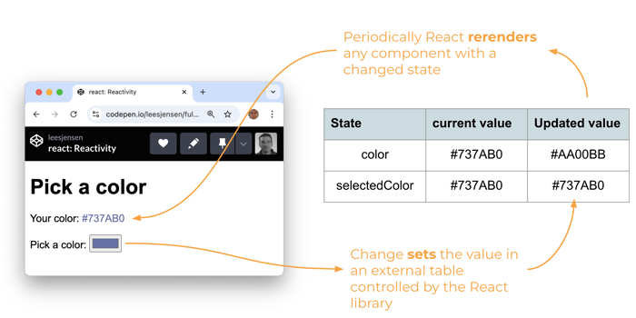

# Reactivity

Making the UI react to changes in user input or data, is one of the architectural foundations of React. React enables reactivity with three major pieces of a React component: `props`, `state`, and `render`.

React keeps a **table** of `state` or `property` values for every component. React updates the table whenever a component's state or properties changes. Then periodically, React will rerender every component that has had a change since the last render occurred.

The following example contains two components: a parent `<ColorPicker/>` component and a child `<Result/>` component. The ColorPicker has a state named `color`. The Result has a property named `selectedColor`. The ColorPicker passes its `color` state to the Result as the `selectedColor` property. This means that any change to the ColorPicker's color will also be reflected in the Result's color. Using properties is a powerful means for a parent to control a child's functionality.



Be careful about your assumptions of when state is updated. Just because you called `updateState` does not mean that you can access the updated state on the next line of code. The update happens asynchronously, and therefore you never really know when it is going to happen. You only know that it will eventually happen.

```jsx
function ColorPicker() {
  const [color, updateColor] = React.useState('#737AB0');

  function onChange(e) {
    updateColor(e.target.value);
  }

  return (
    <div>
      <h1>Pick a color</h1>
      <Result selectedColor={color} />

      <p>
        <span>Pick a color: </span>
        <input type='color' onChange={onChange} value={color} />
      </p>
    </div>
  );
}

function Result({ selectedColor }) {
  return (
    <div>
      <p>
        Your color: <span style={{ color: selectedColor }}>{selectedColor}</span>
      </p>
    </div>
  );
}
```

## ☑ Assignment

Create a fork of this [CodePen](https://codepen.io/leesjensen/pen/NWzYzXE) and experiment. Try changing the input from using the color picker, to using an text input that reactively displays the text as you type.

Don't forget to update your GitHub startup repository `notes.md` with all of the things you learned and want to remember.

_If your section of this course requires that you submit assignments for grading_: Submit your CodePen URL to the Canvas assignment.

### 🧧 Possible solution

If you get stuck here is a possible solution.

```jsx
function ColorPicker() {
  const [text, updateText] = React.useState('red');

  function onChange(e) {
    updateText(e.target.value);
  }
  return (
    <div>
      <h1>Survey</h1>
      <Result selectedColor={text} />

      <p>
        <span>Type some text: </span>
        <input type='text' onChange={onChange} defaultValue='red' />
      </p>
    </div>
  );
}

function Result({ selectedColor }) {
  return (
    <div>
      <p>
        Your color:
        <span style={{ color: selectedColor }}>{selectedColor}</span>
      </p>
    </div>
  );
}
```
